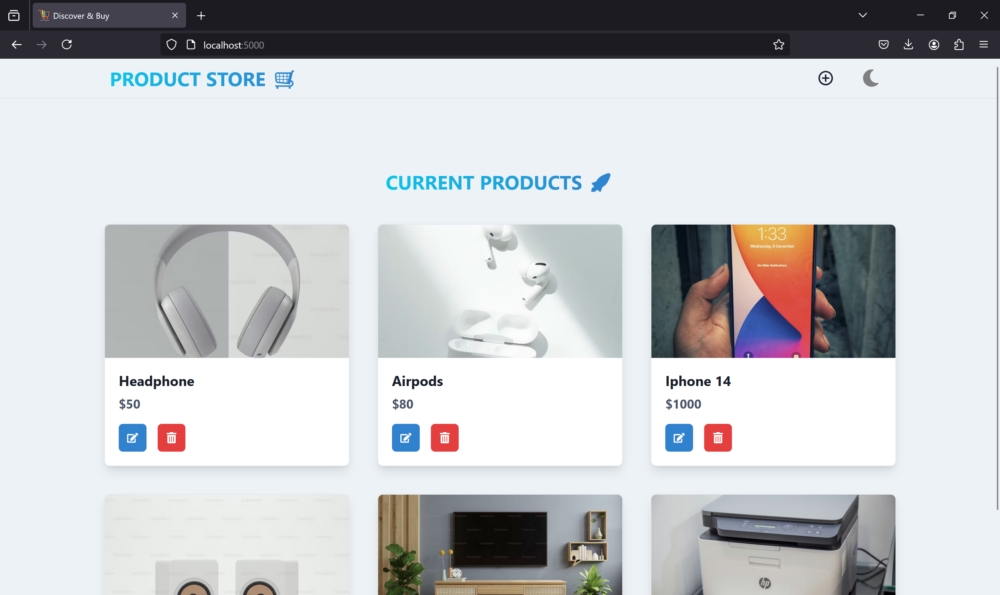
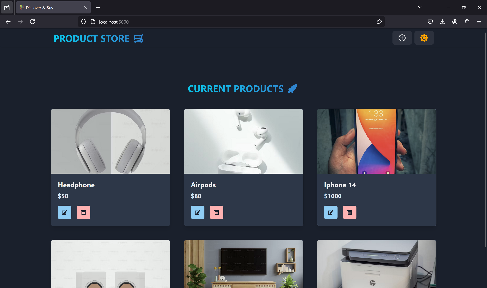
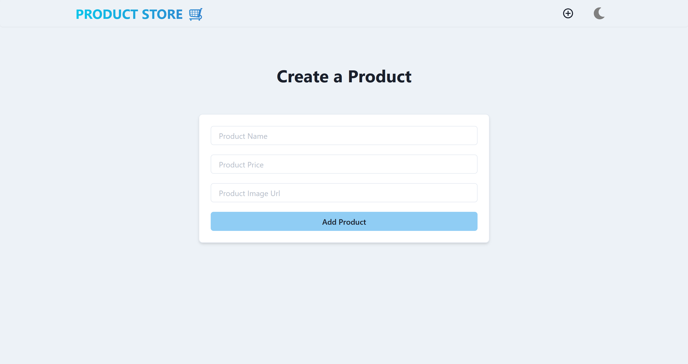
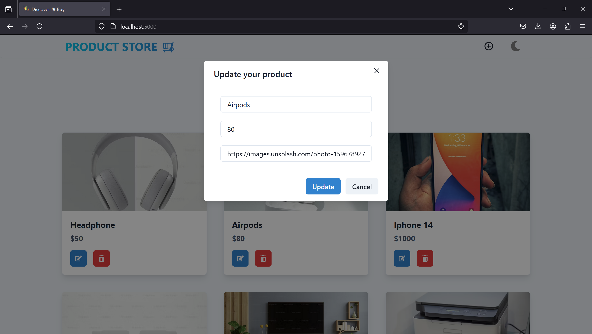

 # MERN E-commerce App  (Screenshots Attached)

Welcome to the MERN E-commerce App! This application allows users to manage a product inventory with functionalities to add, update, and delete products. Built using the MERN stack (MongoDB, Express.js, React.js, Node.js) and styled with Chakra UI, this app provides a sleek and modern user interface.

## Features

- **Add Products**: Easily add new products to the inventory.
- **Update Products**: Modify existing product details.
- **Delete Products**: Remove products from the inventory.
- **Responsive Design**: Fully responsive layout for seamless user experience on all devices.
-  **Dark Mode**: Supports dark mode for comfortable viewing in low-light conditions.

<h1 align="center">Ecommerce Screenshots 🚀</h1>

